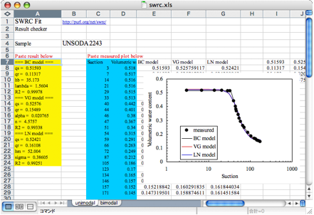
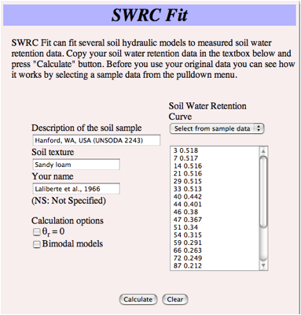
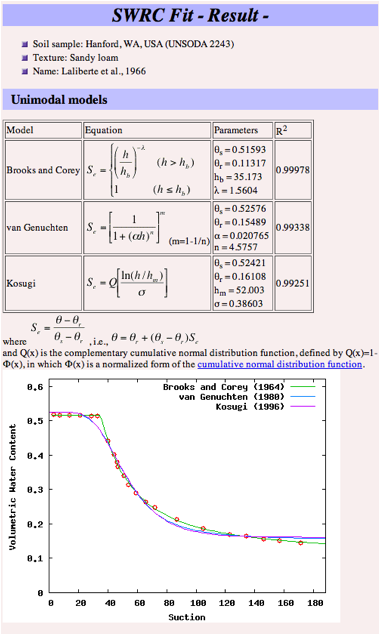

# swrcfit (SWRC Fit) - [doi:10.5194/hessd-4-407-2007](http://dx.doi.org/10.5194/hessd-4-407-2007)

SWRC Fit (Soil Water Retention Curve Fit) is a program which performs nonlinear fitting of following 5 models by Levenberg-Marquardt method.

1. BC model (Brooks and Corey, 1964)
2. VG model (van Genuchten, 1980)
3. LN model (Kosugi, 1996)
4. DB model (Durner, 1994)
5. BL model (Seki, 2007)

Basic information of this program is summarized:

* Publication: [doi:10.5194/hessd-4-407-2007](http://dx.doi.org/10.5194/hessd-4-407-2007)
* Website: http://swrcfit.sourceforge.net/
* Web interface: http://seki.webmasters.gr.jp/swrc/
* Author: Katsutoshi Seki (http://researchmap.jp/sekik/)
* License: GNU General Public License
* Version of this distribution: 1.2

This file can be viewed online here: https://github.com/sekika/swrcfit/blob/master/README.md

## Distributed package

1. swrc.m ... Fitting of unimodal models (BC, VG and LN)
2. bimodal.m ... Fitting of bimodal models (DB and BL)
3. swrc.txt ... Sample data
4. result.txt ... Sample result
5. swrc.xls ... Microsoft Excel worksheets for checking the result.
6. README.md, fig1.png, fig2.png, fig3.png ... This file
7. ChangeLog ... Version history
8. COPYING ... GNU General Public License

## Installation of GNU Octave

   The two types of software, `swrc.m` and `bimodal.m`, are written in GNU Octave, and, therefore, GNU Octave should be installed in the system. GNU Octave is a high-level language, primarily intended for numerical computations, available for downloading from the GNU Octave Website (http://www.gnu.org/software/octave/). The installation instructions are given in the Website. It works on various operating systems including Windows, Mac OS X, Linux and OS/2.

After installing GNU Octave, some necessary packages for running SWRC Fit, `leasqr.m` and `dfdp.m` and several other files which are used from these files (cpiv_bard.m, \__dfdp__.m, \__lm_svd__.m, \__plot_cmds__.m), should be installed from the octave-forge package (http://octave.sourceforge.net/). From octave shell, these files can be installed with `pkg install -forge struct optim`. In case the installation of package with this command fails, download these files manually:
* [leasqr.m](http://sourceforge.net/p/octave/optim/ci/default/tree/inst/leasqr.m)
* [dfdp.m](http://sourceforge.net/p/octave/optim/ci/default/tree/inst/dfdp.m)
* [cpiv_bard.m](http://sourceforge.net/p/octave/optim/ci/default/tree/inst/cpiv_bard.m)
* [\__dfdp__.m](http://sourceforge.net/p/octave/optim/ci/default/tree/inst/private/__dfdp__.m)
* [\__lm_svd__.m](http://sourceforge.net/p/octave/optim/ci/default/tree/inst/private/__lm_svd__.m)
* [\__plot_cmds__.m](http://sourceforge.net/p/octave/optim/ci/default/tree/inst/private/__plot_cmds__.m)

   Installing [Octave Workshop](http://sourceforge.net/projects/octave-workshop/files/) will provide you with all necessary environment for the GNU Octave itself and the Octave-forge package.

## Preparation of data

   The input data, i.e., the soil water retention curve, should be prepared as a text file with two columns, using the file name `swrc.txt`. Sample data is included in the package. The first column is the suction head and the second
   column is the volumetric water content, where space is used as
   a delimiter. For example;

```swrc.txt
0 0.2628
20 0.237
30 0.223
40 0.211
50 0.2035
70 0.1855
100 0.169
200 0.151
430 0.1399
640 0.131
1050 0.1159
```

   Lines beginning with "#" are regarded as comment and neglected.  Any unit can be used as the input data, and the calculated data depends on the unit used as the input data.

   Optionally, `swrc.txt` can have the third column. When it has the third column, it is interpreted as a weight for each parameter.

  For example,

```swrc.txt
0 0.2628 1
20 0.237 1
40 0.211 1
70 0.1855 1
100 0.169 1
1050 0.1159 3
```

   This data has weight of 1 for the suction of 0, 20, 40, 70, 100 and 3 for the suction of 1050.

## Calculation options

   This section is for users who would like to control the way of fitting. If you are not interested in it, you can bypass this section and go directly to the next section, and come back to this section when necessary. The programs swrc.m and bimodal.m have "Setting" block in the program itself as follows.

```octave:swrc.m
# Setting
output_precision=7; # precision of the output
qsin = max(y); # initial value of qs
cqs=1; # cqs=1; qs is variable, cqs=0; qs is constant
qrin = min(y); # initial value of qr
cqr=1; # cqr=1; qr is variable, cqr=0; qr is constant
# qrin=0; cqr=0; # For setting qr=0 as a constant
pqr=1; # pqr=1; qr >= 0, pqr=0; qr can be negative
adv=0; # adv=1; advanced output; adv=0; normal output;
```

   The setting block can be edited directly with a text editor. By editing this "Setting" block, calculation option can be controlled.

   The first line, "# Setting",  is a comment. It indicates that this is a setting block. GNU Octave language ignores the rest of a line following a sharp sign ("#").

   The second line sets the precision of the ouput. In GNU Octave, the variable output_precision specifies the minimum number of significant figures to display for numeric output.

   The lines 3-4 specify the variable q[s], the saturated water content. In this program, q[s] is shown as "qs". Two parameters, qsin and cqs, controls how the program treats this variable. qsin is the initial value of q[s] and cqs is a parameter which decides q[s] is constant or variable; when cqs is set as 0, q[s] is treated as a constant, and when cqs is 1, q[s] is treated as a variable. By default, initial value of q[s]is set as the maximum value of the soil water content, and it is set as a variable, but it can be changed by editing this section. For example, for setting q[s] = 0.35 as a constant, following line can be added after the third line;

```
qsin=0.35; cqr=0;
```

   The lines 5-8 specify the variable q[r], the residual water content. In this program, q[r] is shown as "qr". Three parameters, qrin, cqr and pqr, controls how the program treats this variable. qrin is the initial value of q[r], cqr is a parameter which decides q[r] is constant or variable; when cqr is set as 0, q[r] is treated as a constant, and when cqr is 1, q[r] is treated as a variable, and pqr is a variable which decides if the restriction of q[r] ³ 0 is imposed. By default, initial value of q[r] is set as the minimum value of the soil water content, and it is set as a variable with the restriction of q[r] ³ 0, but it can be changed by editing this section. For example, for seting q[r] = 0 as a constant value, the 7th line is to be commented out,, i.e., the first "#" mark is to be deleted. For setting q[r] = 0.05 as a constant value, following line can be added after the 7th line;

```
qrin=0.05; cqr=0;
```

   To disable the restriction of q[r] >= 0,  the 8th line, pqr=1, is to be changed to pqr=0.

   The line 9 controls the output mode; the parameter adv defines how the result is shown. The default value is adv=0, where only basic information is shown (normal mode), and when it is changed to adv=1, advanced information (correlation matrix and standard deviation) is also shown as a result (advanced mode).

## Running the program

   The programs (`swrc.m` and `bimodal.m`) and data (`swrc.txt`) should be placed in the same directory (folder). In that directory, `swrc.m` should be typed to run the fitting of unimodal (BC, VG, and LN) models, and `bimodal.m` should be typed to run the fitting of the DB and BL models. In the UNIX system `./swrc.m` and `./bimodal.m` is preferred, and the executable file mode should be set. The result is shown in the standard output as follows. Sample result obtained from sample data is included as `result.txt` in the package.

```
=== BC model ===
qs = 0.2627996
qr = 0.05846708
hb = 13.11246
lambda = 0.2780126
R2 = 0.9946961
=== VG model ===
qs = 0.2633070
qr = 0.1041973
alpha = 0.03760151
n = 1.598337
R2 = 0.9953371
=== LN model ===
qs = 0.2639328
qr = 0.1205137
hm = 63.63318
sigma = 1.392247
R2 = 0.9924899
```

   If advanced mode is selected (see the previous section), correlation matrix and standard deviation are also shown as follows.

```
=== BC model ===
qs = 0.2627996
qr = 0.05846708
hb = 13.11246
lambda = 0.2780126
R2 = 0.9946961
CorrelationMatrix =
 1.000000e+00   -1.930206e-13   -5.697150e-01   -1.082819e-12
-1.962351e-13    1.000000e+00    6.368129e-01    9.864592e-01
-5.697150e-01    6.368129e-01    1.000000e+00    6.982723e-01
-1.087807e-12    9.864592e-01    6.982723e-01    1.000000e+00
StandardDeviation =
   5.159034e-03
   3.148803e-02
   2.085881e+00
   8.040429e-02
=== VG model ===
qs = 0.2633070
qr = 0.1041973
(continued)
```

   The order of the element is the same as the result display; in the order of qs, qr, hb and lambda. The above example is the case where q[s] and q[r] are set as variables (cqs=1 and cqr=1), and if either or both of the parameters are set as constant, correlation matrix and standard deviation are shown only for the parameters set as a variable.

## Checking the result

   Using the Microsoft Excel worksheet, `swrc.xls`, the fitted curves can be checked (**Fig. 1**). By copying and pasting the result of the program output onto the yellow part and the measured data onto the blue part of the spreadsheet, The fitted curves are drawn in the graph of the same spreadsheet.  



Fig. 1 Spreadsheet for checking the result

## Web interface of the SWRC Fit

   The Web interface of the SWRC Fit (http://purl.org/net/swrc/) is written in the program language perl and works as a cgi program. The perl program invokes GNU octave and executes the calculation engine of `swrc.m` and `bimodal.m`.

   The screenshot of the user interface is shown in **Fig. 2**. Soil water retention data, prepared as the same format as `swrc.txt` in explained above, is to be copied and pasted in the textbox. It can also be selected from the sample soil water retention data in the UNSODA database (Nemes et al., 2001).  In other textboxes, the description of the soil sample, soil texture, and name can be written. The description written here appears in the results screen. The calculation options of q[r]=0 can be set by checking appropriate boxes. By default, only unimodal (BC, VG and LN) models are used, and when the users select the "Bimodal models" checkbox, bimodal (DB and BL) models will also be used. After that, the calculation starts by pressing the "Calculate" button.



Fig. 2 Screenshot of the input display of the web interface (http://purl.org/net/swrc/)

   In the result screen, the result of the nonlinear fit is shown as **Fig. 3**. The models, equations, parameters, and R^2 values are shown in tabular form, and the fitting curves with measured data points are also shown in a graph. If the bimodal model is selected, the results of the bimodal models are shown separately. By looking at the results, the accuracy of the fit with different models can be compared in both R^2 values and fitting curves. The description of the soil sample and the original data is also displayed in the results screen so that the users can print out and store all the necessary information.



Fig. 3 Screenshot of the results display of web interface (http://purl.org/net/swrc/)

## Citation of this work

Please cite this paper when you publish your work using SWRC Fit.

* Seki, K. (2007) SWRC fit - a nonlinear fitting program with a water retention curve for soils having unimodal and bimodal pore structure. Hydrol. Earth Syst. Sci. Discuss., 4: 407-437. [doi:10.5194/hessd-4-407-2007](http://dx.doi.org/10.5194/hessd-4-407-2007)

[BibTeX](http://www.hydrol-earth-syst-sci-discuss.net/4/407/2007/hessd-4-407-2007.bib) and [EndNote](http://www.hydrol-earth-syst-sci-discuss.net/4/407/2007/hessd-4-407-2007.ris) files are also available.

## Reference

1. Brooks, R. H., and Corey, A.T.: Hydraulic properties of porous media. Hydrol. Paper 3. Colorado State Univ., Fort Collins, CO, USA, 1964.
2. Durner, W.: Hydraulic conductivity estimation for soils with heterogeneous pore structure. Water Resour. Res., 30(2): 211--223, 1994.
3. Kosugi, K.: Lognormal distribution model for unsaturated soil hydraulic properties. Water Resour. Res. 32(9), 2697--2703, 1996.
Nemes, A., M.G. Shaap, F.J. Leij, and J.H.M. Wosten: Description of the unsaturated soil hydraulic database UNSODA version 2.0. J. Hydrol. (Amsterdam) 251:151--162, 2001.
4. Seki, K. (2007) SWRC fit - a nonlinear fitting program with a water retention curve for soils having unimodal and bimodal pore structure. Hydrol. Earth Syst. Sci. Discuss., 4: 407-437.
5. van Genuchten, M.T.: A closed-form equation for predicting the hydraulic conductivity of unsaturated soils. Soil Sci. Soc. Am.  J. 44, 892--898, 1980.
